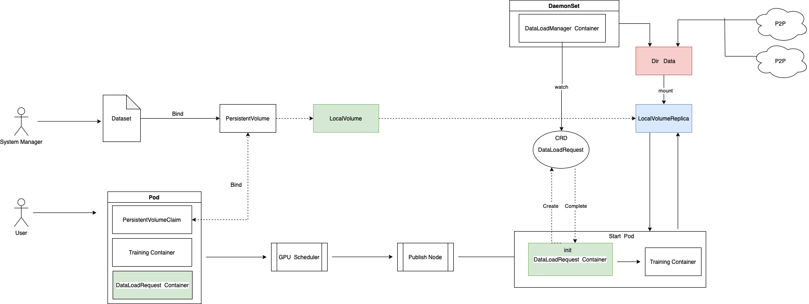

# DataStore

English | [简体中文](./README_zh.md)

Datastore is a project developed to accelerate local storage hwameistor to load data. 
It can help hwameistor to be well applied in AI scenarios and other scenarios that require fast data loading for training.

## Release Status

See [current releases](https://github.com/hwameistor/datastore/releases).

## Modules and Code

Datastore contains several modules:

* [dataset-manager](#dataset-manager)
* [dataload-manager](#dataload-manager)

### dataset-manager

The Dataset Manager (DSM) is designed to manage datasets and allocate local acceleration cache volumes for datasets. 
Other modules (such as DLM) can use the cache volumes provided by DSM to load datasets.
[Learn more](./docs/dsm.md)

### dataload-manager

Dataload-manager (DLM) provides a service for loading data sets for local cache volumes.
It aims to quickly pull data sets for application programs for training in AI training environments.
[Learn more](./docs/dlm.md)

## Quick Use
[Learn more](./docs/use.md)

## Documentation

For full documentation, please see our website [hwameistor.io](https://hwameistor.io/docs/intro).

For detailed adopters that have HwameiStor deployed in a production environment or a user acceptance testing environment,
please check the [adopters list](https://github.com/hwameistor/hwameistor/adopters.md).

## Community

We welcome contributions of any kind.
If you have any questions about contributing, please consult the [contributing documentation](https://github.com/hwameistor/hwameistor/docs/docs/contribute/CONTRIBUTING.md).

### Blog

Please follow our [weekly blogs](https://hwameistor.io/blog).

### Slack

If you want to join the hwameistor channel on CNCF slack, please **[get invite to CNCF slack](https://slack.cncf.io/)**
and then join the [#hwameistor](https://cloud-native.slack.com/messages/hwameistor) channel.

### WeChat

HwameiStor tech-talk group:

## Discussion

Welcome to follow our roadmap discussions [here](https://github.com/hwameistor/hwameistor/discussions)

## Pull Requests and Issues

Please feel free to raise requests on chats or by a PR.

We will try our best to respond to every issue reported on community channels,
but the issues reported [here](https://github.com/hwameistor/hwameistor/discussions)
on this repo will be addressed first.

## License

Copyright (c) 2014-2023 The HwameiStor Authors.

Licensed under the Apache License, Version 2.0 (the "License");
you may not use this file except in compliance with the License.
You may obtain a copy of the License at
<http://www.apache.org/licenses/LICENSE-2.0>.