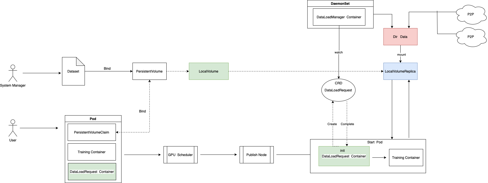

# DataStore

简体中文 | [English](./README.md)

Datastore 是为了加速本地存储 hwameistor 加载数据而开发的项目。
它可以帮助 hwameistor 很好地应用于 AI 场景以及其他需要快速加载数据进行训练的场景。

## 发版状态

参阅 [current releases](https://github.com/hwameistor/datastore/releases).

## 模块和代码

Datastore 包含若干模块：

* [数据集管理器](#dataset-manager)
* [数据加载管理器](#dataload-manager)

### 数据集管理器

数据集管理器（DSM）用于管理数据集，为数据集分配本地加速缓存卷。
其他模块（如DLM）可以使用DSM提供的缓存卷加载数据集。
[了解更多](./docs/dsm.md)

### 数据加载管理器

Dataload-manager (DLM) 提供为本地缓存卷加载数据集的服务。
旨在快速拉取数据集供应用程序在 AI 训练环境中进行训练。
[了解更多](./docs/dlm.md)

## Quick Use
[了解更多](./docs/use.md)

## 文档

For full documentation, please see our website [hwameistor.io](https://hwameistor.io/docs/intro).

For detailed adopters that have HwameiStor deployed in a production environment or a user acceptance testing environment,
please check the [adopters list](https://github.com/hwameistor/hwameistor/adopters.md).

## 社区

我们欢迎任何形式的贡献。如果您有任何有关贡献方面的疑问，请参阅[贡献指南](./CONTRIBUTING.md)。

### 博客

请关注我们的[每周博客](https://hwameistor.io/blog)。

### Slack

如果你想加入我们在 CNCF Slack 的 hwameistor 频道，**请先[接受 CNCF Slack 邀请](https://slack.cncf.io/)**，然后加入 [#hwameistor](https://cloud-native.slack.com/messages/hwameistor)。

### 微信

HwameiStor 技术沟通群：

## 讨论

欢迎在 [Discussion](https://github.com/hwameistor/hwameistor/discussions) 查阅 Roadmap 相关的讨论。

## PR 和 Issue

欢迎与开发团队聊天沟通，也非常欢迎一切形式的 PR 和 Issue。

我们将尽力回应在社区报告的每个问题，但我们会首先解决在[此 repo 中报告的](https://github.com/hwameistor/hwameistor/discussions)问题。

## 许可证

版权所有 (c) 2014-2023 HwameiStor 开发团队

Licensed under the Apache License, Version 2.0 (the "License");
you may not use this file except in compliance with the License.
You may obtain a copy of the License at
<http://www.apache.org/licenses/LICENSE-2.0>